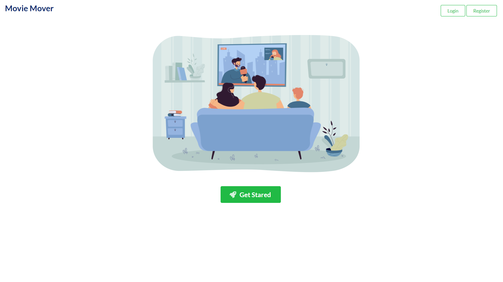
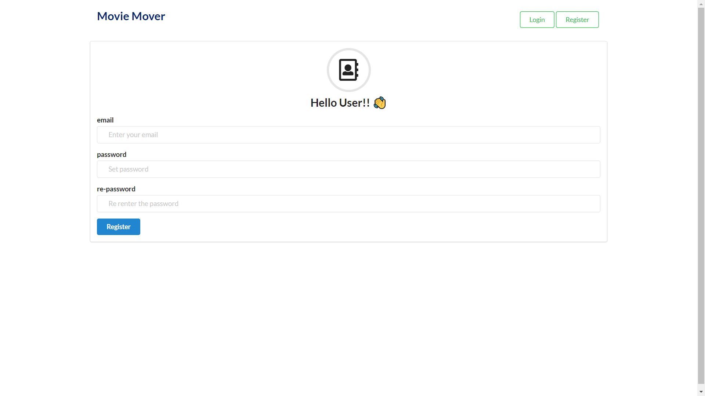
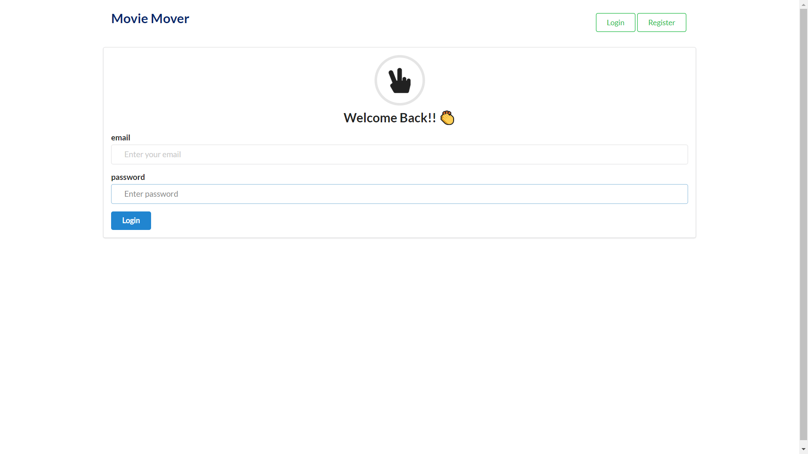
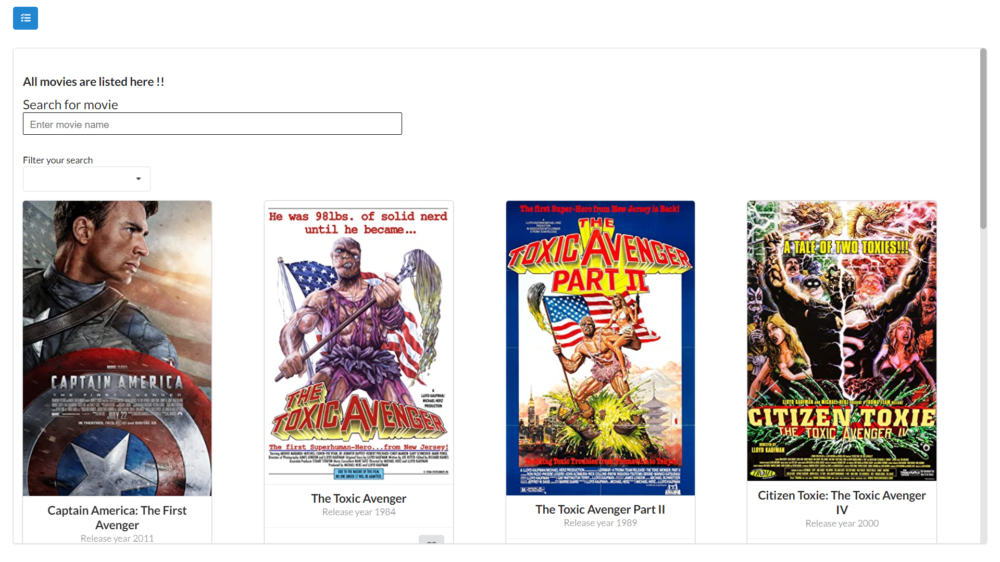
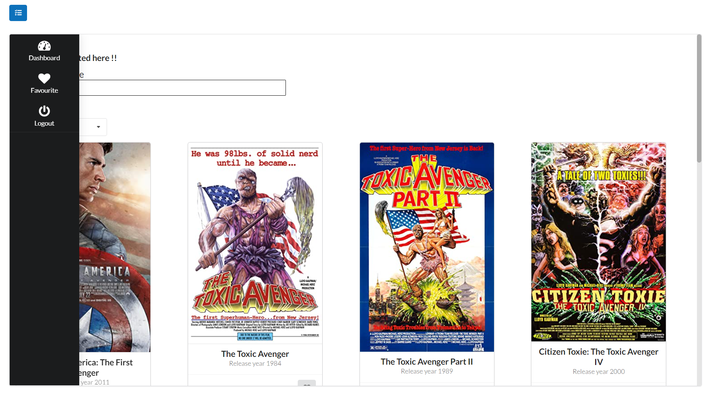
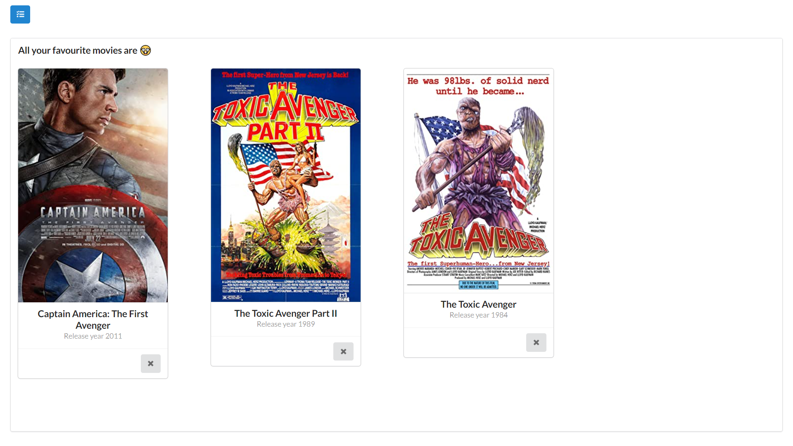

# movie-db

## Acheived Goals
- [X] Explore the API provided.
- [X] To list movies from the API provided.
- [X] Have a simple user registration (an email and password) and login.
- [X] Ability to search a movie/series with its name and if possible, with
- [X] various other fields (, actor, director, year, etc).
- [X] Search should be triggered without an enter or search button with a
delay of 2 seconds.
- [X] Ability to add movies to favourites and to remove from favourites as
well.
- [X] Users should be able to see movies he/she added as favourites.
- [X] Ability to logout.

## Sneak Peak:

- Landing page of app.

- Register page

- Login page

- Dashboard where you can search, find and add movie to your favourite list.

- Dashboard menu for logout and navigation.

- Favourite page from where you can explore/delete your liked movies.

## Asset

- Deployed link: https://movie-mover.netlify.app/

## Authentication
- this app used simple session based authentication.

